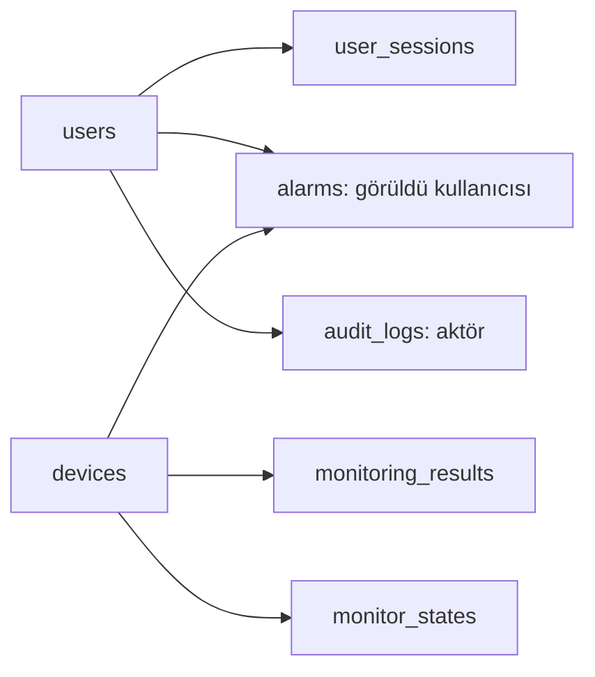
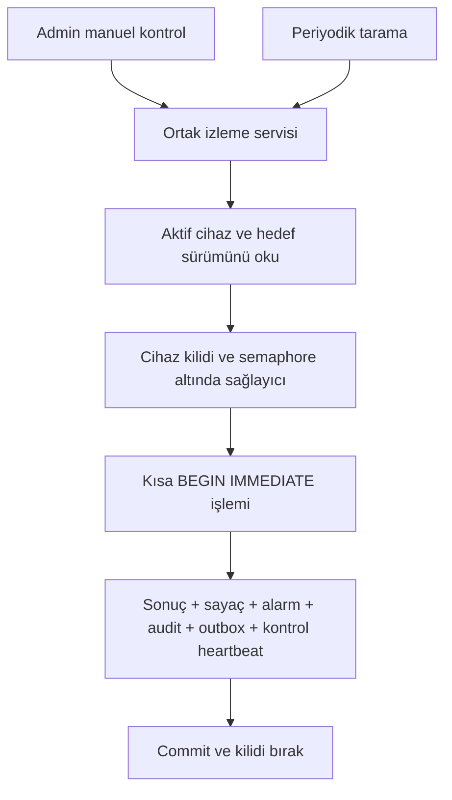

# Mimari ve çalışma akışı

Güncel sürüm: **0.5.0**, şema **20260913_0004**. Tek kurum ve tek süreç sınırı sürer.

Uygulama, tek Uvicorn sürecinde çalışan FastAPI servisidir. Jinja2 ilk Türkçe
sayfayı üretir; yerel JavaScript dosyaları aynı sunucudaki JSON API'lerini okur.
SQLite kalıcı veriyi, Alembic şema geçmişini tutar. Başlangıçta migration veya
kullanıcı oluşturulmaz; bunlar ayrı yönetim komutlarıdır.

## Modüller

| Konum | Sorumluluk |
|---|---|
| `app/main.py` | Uygulama, router, statik dosyalar ve lifespan; SQLite süreç kilidi |
| `app/config.py`, `database.py`, `models.py` | Ayar doğrulama, bağlantı/Session ve veri modeli |
| `app/dependencies.py`, `api/auth.py`, `services/security.py` | Oturum, rol, CSRF/origin, giriş ve hız sınırı |
| `api/devices.py` | Envanter ve manuel kontrol/geçmiş uçları |
| `services/monitoring.py` | Sağlayıcı seçimi, cihaz kilidi, eşzamanlılık sınırı, ölçüm kaydı |
| `services/scheduler.py` | Tek periyodik tarama döngüsü ve başlat/durdur |
| `services/alarms.py`, `api/monitoring.py` | Alarm geçişleri, görüldü, genel özet |
| `services/audit.py`, `api/audit.py` | Denetim kaydı yazma ve admin okuması |
| `services/reporting.py`, `api/reports.py` | Ortak tarih filtreleri, özet, sınırlı grafik ve CSV |
| `static/app.js`, `static/reports.js`, `templates/` | Türkçe panel, form işlemleri ve grafik |
| `static/vendor/chartjs-4.5.1/` | Yerel Chart.js, MIT lisansı ve kaynak/bütünlük bilgisi |
| `app/cli.py`, `app/demo.py` | Görünmeyen parola girişiyle kullanıcı yönetimi; ayrı mock demo |

## Kalıcı veri

| Tablo | İlişki ve anlam |
|---|---|
| `devices` | Envanter; benzersiz IP, aktiflik ve değişen `target_version` |
| `monitoring_results` | Cihaza bağlı geçmiş; ölçüm anındaki IP/sürüm, mod, kaynak, sonuç, UTC ve nullable RTT |
| `monitor_states` | Cihaz + mod bileşik anahtarı; güncel hedefin ardışık yanıtsızlık sayacı |
| `alarms` | Cihaz/hedef/mod için kalıcı alarm; görüldü kullanıcısı `users` tablosuna bağlı |
| `users` | Benzersiz normalize kullanıcı adı, Argon2id hash, rol ve aktiflik |
| `user_sessions` | Kullanıcıya bağlı oturum; giriş öncesinde kullanıcı boş olabilir; tokenların yalnızca hash'leri |
| `audit_logs` | Aktör, kaynak, işlem, hedef, sonuç ve UTC; kullanıcı aktörü nullable olabilir |
| `alembic_version` | Son şema sürümü: `20260912_0003` |

Cihazlar silinmek yerine pasife alınır. Geçmişteki IP, güncel envanter IP'siyle
değiştirilmez. CSV'deki cihaz adı ise güncel addır; tarihsel ad snapshot'ı yoktur.
Foreign key'ler ve kontrol kısıtları veritabanında da uygulanır. Açık alarm için
kısmi benzersiz indeks aynı hedef/modda ikinci açık alarmı engeller.

## Kontrol akışı

Ağ işlemi boyunca yazma transaction'ı tutulmaz; görevler Session paylaşmaz.
Sonuç kaydında hedef tekrar doğrulanır. Bu sırada cihaz değişmişse sonuç geçmişte
`is_current=false` kalır ve yeni hedefin alarmını değiştirmez. `evaluated` alanı
aynı sonucu tekrar değerlendirmeyi etkisiz kılar.

Zamanlayıcı başlangıçta duraklatılmıştır. Admin başlatınca ilk tarama hemen yapılır;
sonraki tarama önceki bitişten itibaren aralık kadar sonra başlar. Birikmiş taramalar
oynatılmaz. Aktif cihazlar sınırlı gruplarla kontrol edilir; meşgul cihaz atlanır.
Kaynak `scheduled`, denetim aktörü `system/scheduler` olur; sahte kullanıcı oturumu
üretilmez. Durdurma devam eden taramayı iptal eder. Süreç kilidi aynı SQLite
dosyasını kullanan ikinci uygulama sürecini engeller.

## Alarm geçişleri

- Ardışık `no_reply` sayısı varsayılan üçe ulaşınca `open` açılır. Sonraki
  yanıtsızlıklar aynı alarmın son gözlemini günceller.
- `reply` seriyi sıfırlar ve aynı hedef/modun açık alarmını `resolved` yapar.
- `error` seriyi sıfırlar; açık alarmı çözmez. Ping çalıştırma/yorumlama hatası
  cihazın yanıtsızlığı değildir.
- **Görüldü** kullanıcı/zaman kaydeder; durum yine açık kalır.
- IP değişimi veya pasife alma `closed` ve idari neden kaydeder.
- Durdurma/yeniden başlatma bekleyen seriyi sıfırlar; kalıcı açık alarmı silmez.

Alarm süresi kesin ağ kesintisi süresi, yanıt oranı da SLA değildir.

## Kimlik doğrulama

CLI varsayılan hesap/parola oluşturmaz. Girişte doğrulanan parola Argon2id hash ile
karşılaştırılır. Rastgele oturum kimliğinin SHA-256 hash'i sunucuda saklanır; cookie
HttpOnly/SameSite=Lax'tır ve HTTPS'te Secure olur. Mutlak/hareketsizlik süreleri ve
kullanıcının aktifliği her istekte değerlendirilir. Giriş oturumu yeniler; çıkış,
parola sıfırlama ve pasife alma ilgili oturumları iptal eder.

Viewer envanter/geçmiş/raporları okur; yazma işlemleri admin gerektirir. Yazmalarda
oturuma bağlı CSRF tokenı ve `APP_BASE_URL` ile Origin/Referer eşleşmesi aranır.
Yetki yalnızca düğmeler gizlenerek sağlanmaz: sunucu ayrıca 401/403 döndürür.
Parola, cookie ve token değerleri audit'e yazılmaz. Giriş hız sınırı süreç belleğinde
olduğu için çok süreçli dağıtım için ortak depo gerekir.

## Mock, ICMP ve rapor

Mock sağlayıcı ağa çıkmaz; standart senaryo IP'nin son baytına, ayrı demo ise
`192.0.2.2` için bellek içindeki yaşam döngüsü dizisine bağlıdır. ICMP sağlayıcı
yalnızca yapılandırılmış CIDR'lere izin verir ve sistem `ping` komutunu shell
kullanmadan çalıştırır. Windows'ta OEM kod sayfası Türkçe çıktıyı çözer. `<1 ms`
yanıtı `reply` ve `latency_ms=null` olur: üst sınırdan sahte RTT hesaplanmaz.
Mock ve ICMP geçmişi/alarmları birbirine karıştırılmaz.

Ping programının watchdog süresini aşması 0.5.0'da teknik `error` kaydedilir;
bu, ping çıktısının bildirdiği hedef yanıtsızlığından farklıdır. Teknik hata alarm
açmaz veya çözmez.

## 0.5.0 bildirim ve bakım katmanı

`services/notifications.py` geçiş başına kararlı olay kimliğiyle outbox ekler;
`UNIQUE(event_id, channel, target_key)` DB korumasıdır. Gönderici aynı süreçte ayrı
`asyncio` görevi; kısa DB claim/complete işlemleri thread'de, SMTP toplam deadline
altında asenkron çalışır. Aynı alarmda en eski aktif olay önce işlenir. SQLite
süreç kilidi tek worker sahibini korur; bu çok süreç koordinasyonu değildir.
Gönderim sırasında DB transaction'ı açık tutulmaz.

`maintenance_windows` cihaz, `alarm_silences` alarm kapsamını tutar.
`services/maintenance.py` yarı açık UTC aralıklarını ve taze ölçümü değerlendirir.
Referanslar outbox'ta kalır. Worker taze ölçüm olmadan sentetik durum üretmez.
`activated_at` bakım başlangıcının işlenmesini, `reconciled_at` bastırılmış olayların
özetle kapatılmasını kalıcı izler. Bunların değişimi ve yeni özet aynı transaction'dadır.

`monitoring_heartbeat` süreç başlangıcı, son zamanlayıcı turu, tamamlanan tarama ve
kontrol zamanını korur. `/api/summary` bunları runtime duraklama, hedef/mod filtreli
freshness ve kuyruk sayılarıyla birleştirir. `/health` korunur; `/ready` bağımlılık
hazır oluşudur ve sağlıklı tarama kanıtı sayılmaz.

`api/operations.py` mevcut admin/viewer ve CSRF bağımlılıklarını kullanır.
`static/operations.js` panel ve istek yardımcılarına bağlanır; kullanıcı verileri
`textContent` ile gösterilir. Gerekçe/dönem bakım kayıtlarında, işlem kimliği audit'te
tutulur. JSON logları alan izin listesi kullanır; SMTP yanıtı ve sırlar dahil edilmez.

SMTP STARTTLS/implicit TLS için sistem CA doğrulaması zorunludur. Varsayılan kapalı,
mock olaylar ağsızdır. Outbox'ta adres/şifre yerine sabit mod ve hedef parmak izi
bulunur; ayar değişikliği eski olayları başka alıcıya taşımaz. SMTP kabulüyle DB
complete commit'i arasında çökme kopya oluşturabilir; tam bir kez teslim yoktur.
İşletim ayrıntıları [kılavuzda](operations.md), dönüşüm sınırları
[yol haritasında](enterprise-roadmap.md) tanımlıdır.

Rapor uçları kontrol başlatmaz. Ortak UTC filtreleri başlangıcı dahil, bitişi hariç
tutar; en fazla 30 gün seçilir. SQL özeti tüm dönemi kapsar, grafik en yeni 2.000
ölçümü gösterir. Boş RTT/yanıtsızlık/hata grafikte sıfır değil boşluktur. CSV aynı
somut filtrelerle UTF-8 BOM, noktalı virgül ve ondalık virgül üretir; üst sınır
varsayılan 50.000 satırdır. Yerel panel/grafik için CDN gerekmez; admin Swagger
sayfası FastAPI'nin varsayılan dış Swagger UI kaynaklarını kullanır.
